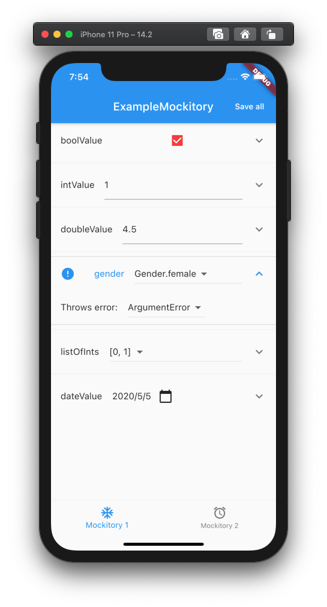

# flutter_mockitory - Mock data layer with Flutter widgets

The purpose of this package is to help test Flutter apps with fake data, but without changing the code.

With Mockitory you can mock data layer using the app itself by adding `flutter_mockitory` widgets.



# How to use it?

## Add dependencies

```yaml

dependencies:
  flutter_mockitory: 
```

If you want to use pure Dart Mockitory (eg. for server apps), use `mockitory` instead of `flutter_mockitory` dependency. 

## Use Mockitory mixin

```dart
import 'package:mockitory/mockitory.dart';

enum Gender { male, female }

class ExampleMockitory with Mockitory {
  @override
  Map<String, MockValue> get initialMockValues => {
        'boolValue': MockValue<bool>(true),
        'intValue': MockValue<int>(1),
        'doubleValue': MockValue<double>(4.5),
        'gender': MockValue<Gender>(Gender.male),
        'listOfInts': MockValue<List<int>>([0, 1]),
        'dateValue': MockValue(DateTime(2020, 5, 5)),
      };

  Stream<Gender> observeGender() => observeMockValueUpdates<Gender>('gender')
      .map((mockValue) => mockValue.value);

  DateTime getDateValue() => getValue<DateTime>('dateValue');
}
```
**NOTE: Remember about using typed MockValue objects. Example: `MockValue<bool>(true)`.**

## Use `MockitoryPage` widget

`MockitoryPage` widget is used to automatically generate list of widgets used to update/display fake data.

```dart
final mockitory = ExampleMockitory();

...

MockitoryPage(
  mockitory: mockitory,
  customDelegates: [
    CustomBoolMockValueDelegate(),
    ChoicesMockValueDelegate<Gender>([Gender.male, Gender.female]),
    IterableMockValueDelegate([
      [0, 1],
      [0, 2]
    ]),
  ],
),
```

### Built-in MockValue Delegates

Delegates are used to define how widgets used to manipulate fake data are built.

These delegates are used by default:

* `BoolMockValueDelegate`
* `StringMockValueDelegate`
* `IntMockValueDelegate`
* `DoubleMockValueDelegate`
* `DateTimeMockValueDelegate`

These delegates needs to be added to `customDelegates` property in `MockitoryPage` widget:

* `ChoicesMockValueDelegate<T>` - eg. `ChoicesMockValueDelegate<Gender>([Gender.male, Gender.female])`
* `IterableMockValueDelegate<T>` - eg. `IterableMockValueDelegate<int>([0, 1], [1, 4, 5])`

### Custom delegates


You can provide your own custom delegate.

```dart
class CustomBoolMockValueDelegate extends MockValueDelegate<bool> {
  @override
  Widget buildMockValueWidget(BuildContext context, bool value, onChanged) {
    return Checkbox(
      activeColor: Colors.red,
      value: value,
      onChanged: (value) => onChanged(MockValue(value)),
    );
  }
}
```